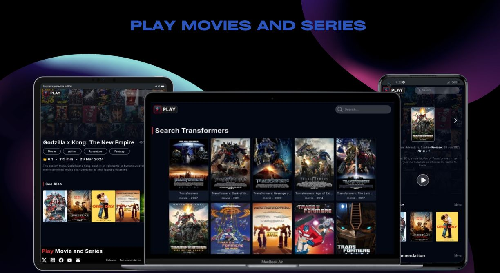

<h1 align="center">Play Movies and Series</h1>
<div align="center">
  <a href="#descrição">Descrição</a> |
  <a href="#iniciar">Iniciar</a> |
  <a href="#licença">Licença</a>
</div>

<p align="center">
  
</p>
<p>
 
</p>

## Descrição

A aplicação e um site de streams de filmes se series, contendo um catalogo vasto de filmes entre os anos 2000 e 2025, divididos em filmes e series.

Os dados vem de uma api publica chamada **[omdbapi.com](https://www.omdbapi.com/)**.

As principais funções do site são:

- filtro por titulo.
- Auto paginação por scroll.
- Login, register e auto login, com validação jwt
- sistema de likes e dislike
- adicionar e remover filmes da lista para assistir depois
- atualização dos dados da conta e sair

Acesse o site **[Play Movies and Series](https://play-movies-series.vercel.app/)**.

## Iniciar

E Necessário ter o Nodejs, o git instalado e a back da aplicação, acesse o repositório **[Aqui](https://github.com/matheus369k/play-movies-series-api)**.

Faça clone do repositório localmente.

```bash
git clone https://github.com/matheus369k/play-movies-series.git
cd ./play-movies-series
```

Instale as dependencies

```bash
npm i
```

Crie um arquivo **.env**, com as variaves ambientes abaixo

```bash
VITE_API_OMDBAPI=https://www.omdbapi.com/
VITE_API_OMDBAPI_KEY=4342g6g6
VITE_BACKEND_URL=http://localhost:3333
```

Agora você pode iniciar o projetos

```bash
npm run dev
```

## Licença

Licença usada **[MIT](./LICENSE.txt)**
